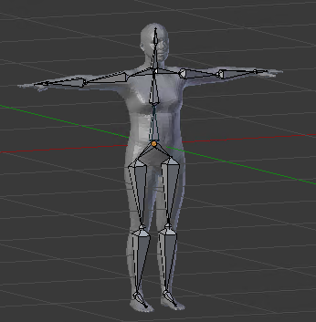
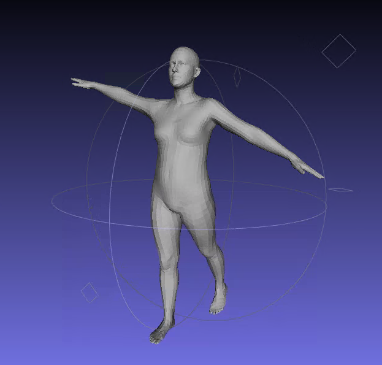

# HumanRegistration
Build a skeleton using Blender and register it to human mesh.

<div  align="center"> 

</div>

## Dependencies
```
Python3.6
Blender2.79
opencv-python
numpy
```

## Demo
You can edit the skeleton and add a new mesh (obtained from scanner, e.g. PhotoScan) in ```HumanRegistration.blend```. Here, we use SMPL template as example.

Then, run the ```export.py``` in Blender to export the parameters.

```main.py``` shows a demo of LBS (Linear Blending Skinning) for registered human.

<div  align="center"> 

</div>

## References
[SMPL](https://smpl.is.tue.mpg.de/)<br>
[顺子老师](https://space.bilibili.com/38988725/)